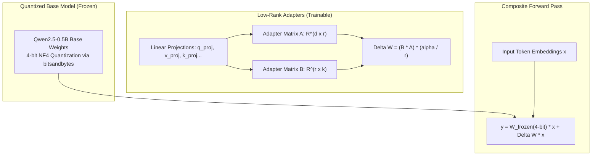

# QLoRA Fine-Tuning for Qwen2.5-0.5B using Unsloth

> A modular, step-by-step engineering implementation of 4-bit Parameter-Efficient Fine-Tuning (PEFT / QLoRA) on the Qwen2.5-0.5B-Instruct architecture using Unsloth and bitsandbytes.

[](https://www.python.org/)
[](https://pytorch.org/)
[](https://github.com/unslothai/unsloth)
[](https://huggingface.co/)

[Repository](https://github.com/Rohitk69992/lora-fine-tune-a-tiny-chat-model-with-unsloth) • [Architecture](#qlora-architecture--memory-optimization) • [Pipeline Stages](#implementation-stages--scaffolding) • [Quickstart](#reproduction--setup)

---

## Overview

Full parameter fine-tuning of modern Large Language Models (LLMs) requires substantial VRAM for optimizer states, gradients, and model weights. For resource-constrained hardware environments (such as consumer GPUs or free-tier cloud instances), **Quantized Low-Rank Adaptation (QLoRA)** paired with kernel optimizations enables high-efficiency instruction tuning with minimal memory overhead.

This repository implements a modular 20-step QLoRA fine-tuning and evaluation pipeline for **`Qwen2.5-0.5B-Instruct`** leveraging **Unsloth's `FastLanguageModel`** framework. It systematically walks through 4-bit quantization verification, LoRA adapter attachment, instruction formatting, supervised training configuration, and text generation.

---

## Key Features

- **4-Bit NF4 Quantization Verification:** Ingests `unsloth/Qwen2.5-0.5B-Instruct-unsloth-bnb-4bit` and programmatically inspects module layers for `bitsandbytes.nn.Linear4bit` quantization.
- **VRAM-Optimized Kernel Execution:** Leverages Unsloth's custom Triton/CUDA kernels to reduce VRAM consumption while accelerating backpropagation.
- **Tokenizer Special Token Handling:** Defensive handling of missing padding tokens with fallback to `eos_token` or dedicated `[PAD]` registration.
- **Modular Test Harness (`scaffold.py`):** Structured evaluation harness for isolating and testing each component of the fine-tuning pipeline.

---

## QLoRA Architecture & Memory Optimization



### Mathematical Formulation
Instead of updating the full weight tensor $\mathbf{W}_0 \in \mathbb{R}^{d \times k}$, QLoRA freezes the 4-bit quantized base weights $\mathbf{W}_0$ and introduces low-rank decomposition matrices $\mathbf{B} \in \mathbb{R}^{d \times r}$ and $\mathbf{A} \in \mathbb{R}^{r \times k}$ (where rank $r \ll \min(d, k)$):
$$\mathbf{W} = \mathbf{W}_0 + \frac{\alpha}{r} (\mathbf{B}\mathbf{A})$$
During backpropagation, gradients are computed exclusively for $\mathbf{A}$ and $\mathbf{B}$, dramatically reducing the trainable parameter footprint to $<1\%$ of the base model.

---

## Implementation Stages & Scaffolding

The core implementation in [`model.py`](model.py) is decomposed into 20 modular functions evaluated sequentially by [`scaffold.py`](scaffold.py):

| Step | Function | Description | Status |
| :---: | :--- | :--- | :---: |
| **1** | `load_base_model_and_tokenizer` | Initializes 4-bit Qwen2.5 via `FastLanguageModel.from_pretrained` | Completed |
| **2** | `count_total_parameters` | Counts parameter tensors via `p.numel()` | Completed |
| **3** | `is_model_4bit_quantized` | Traverses modules to verify `bnb.nn.Linear4bit` layers | Completed |
| **4** | `ensure_pad_token` | Guarantees tokenizer pad token configuration | Completed |
| **5** | `get_lora_target_modules` | Target module selector (`q_proj`, `k_proj`, `v_proj`, `o_proj`, etc.) | Planned |
| **6** | `attach_lora_adapters` | Attaches LoRA adapters via `FastLanguageModel.get_peft_model` | Planned |
| **7** | `count_trainable_parameters` | Computes trainable vs. frozen parameter count | Planned |
| **8** | `trainable_fraction` | Computes parameter efficiency percentage | Planned |
| **9–11** | Instruction Formatting | Template formatting for instruction/response pairs | Planned |
| **12–14** | Dataset & Tokenization | Token budgeting and text dataset tensor formatting | Planned |
| **15–17** | SFT Trainer & Training | `TrainingArguments` and supervised fine-tuning execution | Planned |
| **18–20** | Inference & Reply Generation | Mode switching and autoregressive completion generation | Planned |

---

## Project Structure

```bash
lora-fine-tune-a-tiny-chat-model-with-unsloth/
├── model.py        # Core implementation file containing modular PEFT functions
├── scaffold.py     # Evaluation runner verifying solution steps sequentially
├── docs/
│   └── index.html  # Interactive step documentation and curriculum
└── README.md
```

---

## Reproduction & Setup

### Prerequisites
- Python 3.10+
- CUDA-enabled GPU (NVIDIA T4, RTX 3050+, or A100 recommended)
- PyTorch with CUDA support

### 1. Clone the Repository
```bash
git clone https://github.com/Rohitk69992/lora-fine-tune-a-tiny-chat-model-with-unsloth.git
cd lora-fine-tune-a-tiny-chat-model-with-unsloth
```

### 2. Install Dependencies
```bash
pip install torch torchvision torchaudio --index-url https://download.pytorch.org/whl/cu121
pip install "unsloth[colab-new] @ git+https://github.com/unslothai/unsloth.git"
pip install bitsandbytes transformers datasets trl accelerate
```

### 3. Run the Scaffolding Test Suite
```bash
python scaffold.py
```

---

## Technical Stack

| Layer | Technology | Purpose |
| :--- | :--- | :--- |
| **Base Model** | Qwen2.5-0.5B-Instruct | Lightweight causal language model |
| **Quantization** | bitsandbytes (4-bit NF4) | Weight quantization and memory reduction |
| **PEFT Acceleration** | Unsloth | Custom CUDA/Triton kernels for fast LoRA training |
| **Model Hub & Tokenization** | Hugging Face Transformers | Tokenizer loading and model abstraction |
| **Supervised Tuning** | TRL / SFTTrainer | Instruction fine-tuning loop |

---

## Limitations & Implementation Scope

- **Active Implementation in Progress:** As documented in the scaffolding matrix, steps 1–4 are solved and verified; steps 5–20 represent the educational curriculum for full SFT completion.
- **Hardware Dependency:** 4-bit quantized inference via `bitsandbytes` requires a CUDA-compatible environment (Linux with NVIDIA drivers or Google Colab/Kaggle).

---

## Author

**Rohit K.**  
*AI & Data Science Student*  
GitHub: [@Rohitk69992](https://github.com/Rohitk69992)
